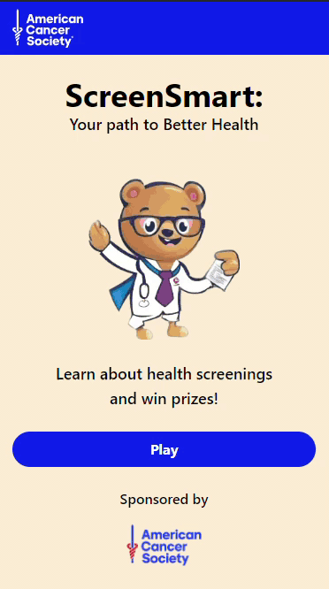

<!-- SHIELDS -->

<!-- PROJECT LOGO & HEADER -->

 

  <h3 align="center"><strong>ScreenSmart</strong></h3>

  

    <strong>Your Path to Better Health</strong>
     
    A web browser game made to educate users on cancer screenings and their importance
     
     
    <a href="https://github.com/MBPKFC/hack-for-humanity">View GitHub</a>
    ·
    <a href="https://hack-for-humanity.vercel.app/">View Game</a>
    ·
    <a href="https://github.com/MBPKFC/hack-for-humanity/issues">Report Bug</a>
  

<!-- TABLE OF CONTENTS -->

  
<strong>Table of Contents</strong>

  <ol>
    <li><a href="#about-the-project">About The Project</a></li>
    <li><a href="#usage">Usage</a>
    <li><a href="#installation">Installation</a></li>
    <li><a href="#contributing">Contributing</a></li>
    <li><a href="#license">License</a></li>
    <li><a href="#contact">Contact</a></li>
  </ol>

<!-- ABOUT THE PROJECT -->

## About The Project

   
  
   
   

SmartScreen, is a solution designed to connect individuals with cancer pre-screening resources, ultimately increasing the number of people who get screened early for better treatment outcomes.

**The Problem**

People lack education and awareness of screening for cancer. Our target audience is the 17.6% that do not get their yearly visits and therefore will not find out what cancer screening they are due for.

**The Solution**

SmartScreen, is a solution to bridge this gap and ensure individuals feel confident and comfortable in taking these essential steps towards better health.

**SmartScreen Features**

- An Engaging and Informative Approach
- A Gamified Experience
- Locator
- Incentives
- Friendly Guidance

**Benefits**

Increased awareness and education about pre-screening
As for the American Cancer Society: Tracking users who found a primary care physician (PCP) through our app. This data supports the ACS in promoting better healthcare.

<!-- USAGE -->

## Usage

In order to use ScreenSmart navigate to the website at [hack-for-humanity.vercel.app/](https://hack-for-humanity.vercel.app/). Once on the webpage if you click on `Play` you will begin the game. Answer the questions to the best of your ability, the point of the game is less about being correct and more about learning the correct answer once you've answered. 

After completing the game portion you will be brought to some consumer data in order for the site to supply you with the best information possible. Once all info has been taken the site will provide you with PCP's (Primary Care Physicians) in your area that you can follow up with for a screening.

<!-- INSTALLATION -->

## Installation

In order to run ScreenSmart locally first clone the repo to your local machine. 

> **Note**
>
> For info on how clone a repo see the [GitHub Docs on cloning a repo](https://docs.github.com/en/repositories/creating-and-managing-repositories/cloning-a-repository)

From there run `npm i` from the root directory. Once all packages have been installed you will need to use the command `npm run dev` from the terminal. This will start both the server and the client concurrently.

<!-- CONTRIBUTING -->

## Contributing

Contributions are what make the open source community such an amazing place to learn, inspire, and create. Any contributions you make are **greatly appreciated**.

If you have a suggestion that would make this better, please fork the repo and create a pull request. You can also simply open an issue with the tag "enhancement".
Don't forget to give the project a star! Thanks again!

1. Fork the Project
1. Create your Feature Branch (`git checkout -b feature/AmazingFeature`)
1. Commit your Changes (`git commit -m 'Add some AmazingFeature'`)
1. Push to the Branch (`git push origin feature/AmazingFeature`)
1. Open a Pull Request

If all of this is new to you take a look at the [GitHub Docs](https://docs.github.com/en/get-started/quickstart/fork-a-repo).

<!-- LICENSE -->

## License

Distributed under the MIT License. See [LICENSE](https://github.com/Mateo-Wallace/npmi.js/blob/main/LICENSE) for more information.

<!-- CONTACT -->

## Contact

Bridgette Lemus - Team Lead - UI Designer - [Email](mailto:bridgette.lemus.se@gmail.com) - [LinkedIn](https://www.linkedin.com/in/bridgettecarmenlemus/)

Christina Manikus - UI/UX Designer - [LinkedIn](https://www.linkedin.com/in/christinamanikus/) - [Portfolio](https://christinamanikus.com/)

Farrukh Karimov - Design Engineer - [GitHub](https://github.com/fkarimov4) - [LinkedIn](https://www.linkedin.com/in/farrukhkarimov/) - [Portfolio](https://farrukhkarimov.com/)

Kenshaw Michaud - Front End Developer - [GitHub](https://github.com/ken862734801) - [Email](mailto:kenshawmichaud@gmail.com) - [LinkedIn](https://www.linkedin.com/in/kenshawm/) 

Peter Lewandowski - Tech Lead - [GitHub](https://github.com/peterlewandowski) - [LinkedIn](https://www.linkedin.com/in/peterlewandowski2010/) - [Portfolio](https://www.peterlewandowski.dev/)

Mateo Wallace - Lead Back End Developer - [GitHub](https://github.com/Mateo-Wallace) - [Email](mailto:mateo.t.wallace@gmail.com) - [LinkedIn](https://www.linkedin.com/in/mateo-wallace/) - [Portfolio](https://mateo-wallace.github.io/)